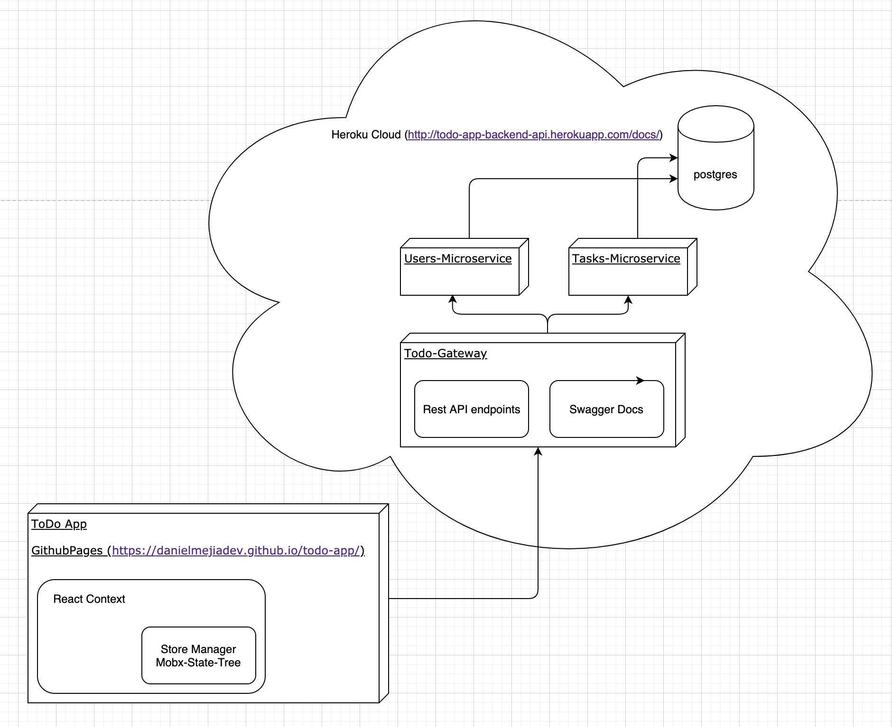

# Todo-microservices

## Description
A Todo-App backend based on micro-services architecture using [NestJS](https://nestjs.com/)

- There's an API-GATEWAY who receives the requests over http protocol and communicate with microservices to manage every resource.
- There's an USERS-MICROSERVICE who receives the requests from gateway over tcp protocol and manage the database users.
- There's an TASKS-MICROSERVICE who receives the requests from gateway over tcp protocol and manage the database tasks.

To check demo, visit [REST-API](http://todo-app-backend-api.herokuapp.com/docs/) for more information.


## Architecture

</img>

## Todo-Users-Microservice Installation

```bash
$ cd microservices/users
# Follow the instructions under microservices/users/README.md
```

## Todo-Tasks-Microservice Installation

```bash
$ cd microservices/tasks
# Follow the instructions under microservices/tasks/README.md
```

## Todo-Gateway Installation

```bash
$ cd todo-gateway
# Follow the instructions under todo-gateway/README.md
```

## Stay in touch

- Author - [Daniel Mejia](https://github.com/danielmejiadev)

## License

This project is licensed under the [MIT licensed](LICENSE) - see the LICENSE file for details.
